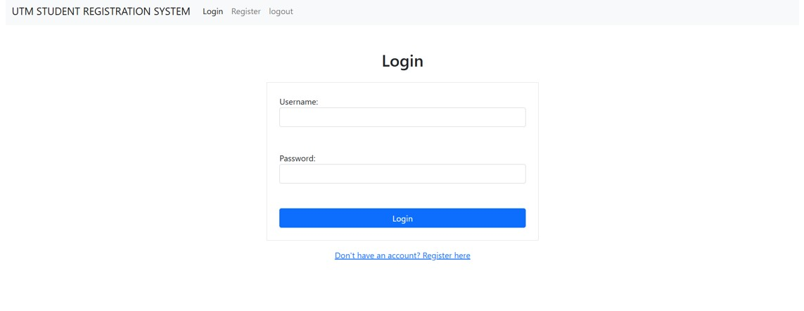
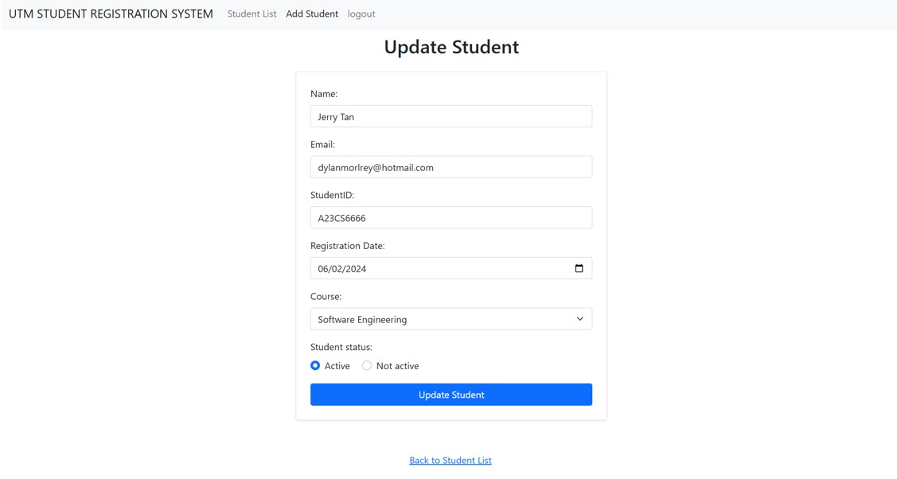

<h1> Student Information Registration System </h1>
<h3> Output for each page </h3> 

<h4> - Register </h4>

<h4> - Login </h4>

<h4> - Student List </h4>

<h4> - Add Student </h4>

<h4> - Update Student Info </h4>

<h4> - Pop Up Message </h4>

<h2> Code </h2>
<a href="Code/db_connection.php"> Code - Database Connection </a>  
<a href="Code/register.php"> Code - Registration </a>  
<a href="Code/login.php"> Code - Login </a>  
<a href="Code/logout.php"> Code - Logout </a>  
<a href="Code/StudentList.php"> Code - Student List </a>  
<a href="Code/AddStudent.php"> Code - Add Student </a>  
<a href="Code/Update.php"> Code - Update Student Info </a>  
<a href="Code/Delete.php"> Code - Delete Student Info </a>  
